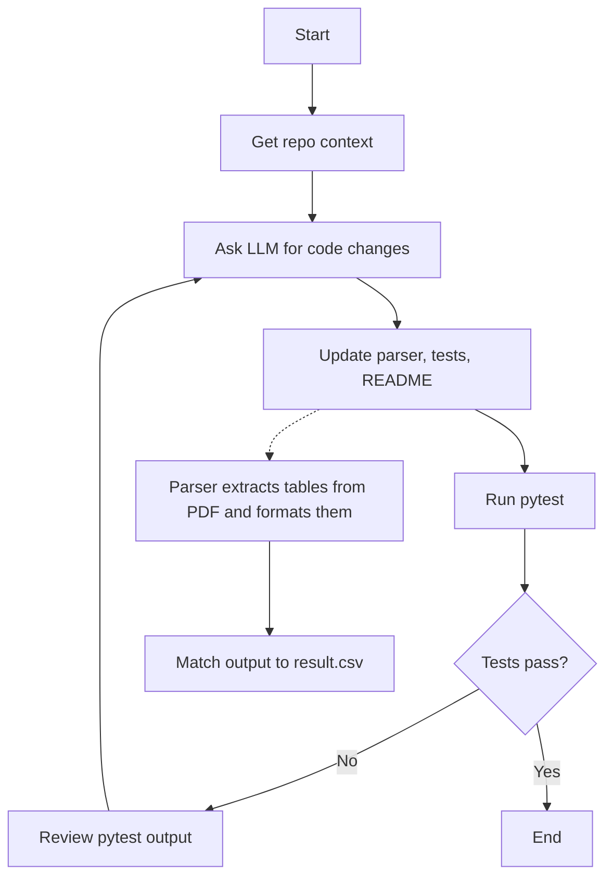

## Project: Autonomous PDF Statement Parser Agent

This repository contains an autonomous coding agent that, when invoked from the CLI, generates a bank PDF-statement parser, creates tests, runs them, and self-fixes up to three times until all tests pass. The agent targets a specific bank folder under `data/<target>/` and ensures the parsed DataFrame matches the provided CSV exactly.

## 5-step run instructions

1) Create and activate a virtual environment  
- Python 3.10–3.12 recommended.  
- Example (Windows PowerShell):  
  - `py -3 -m venv .venv`  
  - `.venv\Scripts\Activate.ps1`

2) Install dependencies  
- `pip install requirements.txt`

3) Set the Groq API key  
- PowerShell: `setx GROQ_API_KEY "sk-..."` (restart shell)  
- macOS/Linux: `export GROQ_API_KEY="sk-..."`

4) Verify data layout for the target  
- Ensure the target folder exists with:  
  - `data/icici/icici.pdf`  
  - `data/icici/result.csv`

5) Run the agent  
- `python agent.py --target icici`  
- The agent will create/update:  
  - `custom_parsers/icici_parser.py`  
  - `tests/test_icici.py`  
- It will run pytest in a loop (≤3 attempts) until tests pass.

## Agent overview (one-paragraph diagram/description)

The agent runs a compact loop: it gathers repository context, asks the LLM to propose full-file patches (parser, tests, README), applies them, and runs pytest in a clean subprocess. If tests fail, it feeds the pytest report back to the LLM for targeted fixes, repeating up to three times. The generated parser uses pdfplumber and pandas to extract and normalize tables from the PDF, reordering columns to match result.csv, while the test enforces strict DataFrame equality.

